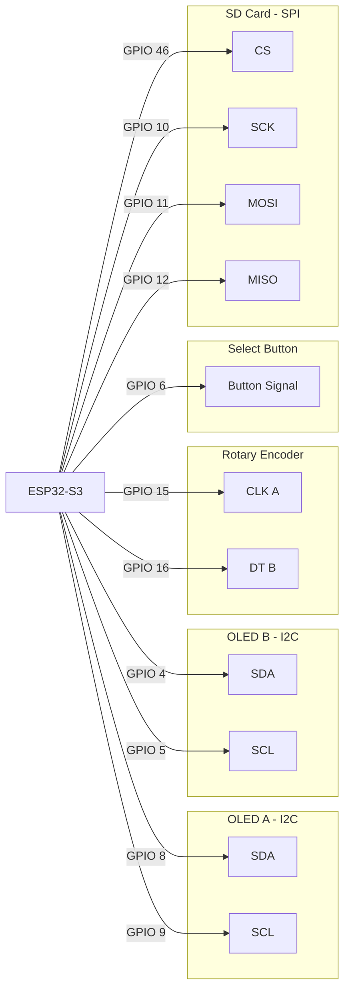

# My-Toolbox
An integrated ESP32 device inside my toolbox to track inventory, linking to a Flutter app.

## Firmware Pinout Wiring

All pin references below are ESP32-S3 GPIO numbers as defined in the firmware source.

### OLED A (I2C)

| Peripheral Signal | ESP32 Pin | Notes |
| --- | --- | --- |
| SDA | GPIO 8 | Defined in firmware as OLED_A_SDA |
| SCL | GPIO 9 | Defined in firmware as OLED_A_SCL |
| VCC | 3V3 | Power rail for OLED A |
| GND | GND | Ground rail for OLED A |

### OLED B (I2C)

| Peripheral Signal | ESP32 Pin | Notes |
| --- | --- | --- |
| SDA | GPIO 4 | Defined in firmware as OLED_B_SDA |
| SCL | GPIO 5 | Defined in firmware as OLED_B_SCL |
| VCC | 3V3 | Power rail for OLED B |
| GND | GND | Ground rail for OLED B |

### Rotary Encoder

| Peripheral Signal | ESP32 Pin | Notes |
| --- | --- | --- |
| CLK (A) | GPIO 15 | Defined in firmware as ENCODER_PIN_A |
| DT (B) | GPIO 16 | Defined in firmware as ENCODER_PIN_B |
| VCC | 3V3 | Encoder power pin |
| GND | GND | Encoder ground pin |

### Select Button

| Peripheral Signal | ESP32 Pin | Notes |
| --- | --- | --- |
| Button Input | GPIO 6 | Active low, uses INPUT_PULLUP |
| VCC | Not connected | Input uses internal pull-up, no external VCC needed |
| GND | GND | Other button terminal to ground |

### SD Card (SPI)

| Peripheral Signal | ESP32 Pin | Notes |
| --- | --- | --- |
| CS | GPIO 46 | Defined in firmware as SD_CS_PIN |
| SCK | GPIO 10 | Defined in firmware as SD_SCK_PIN |
| MOSI | GPIO 11 | Defined in firmware as SD_MOSI_PIN |
| MISO | GPIO 12 | Defined in firmware as SD_MISO_PIN |
| VCC | 3V3 | SD module/card power |
| GND | GND | SD module/card ground |

### Wi-Fi Access Point

| Setting | Value | Notes |
| --- | --- | --- |
| SSID | Cam's Toolbox | AP network name broadcast by firmware |
| Password | (open network) | AP password is currently empty in firmware |

## Wiring Diagram

